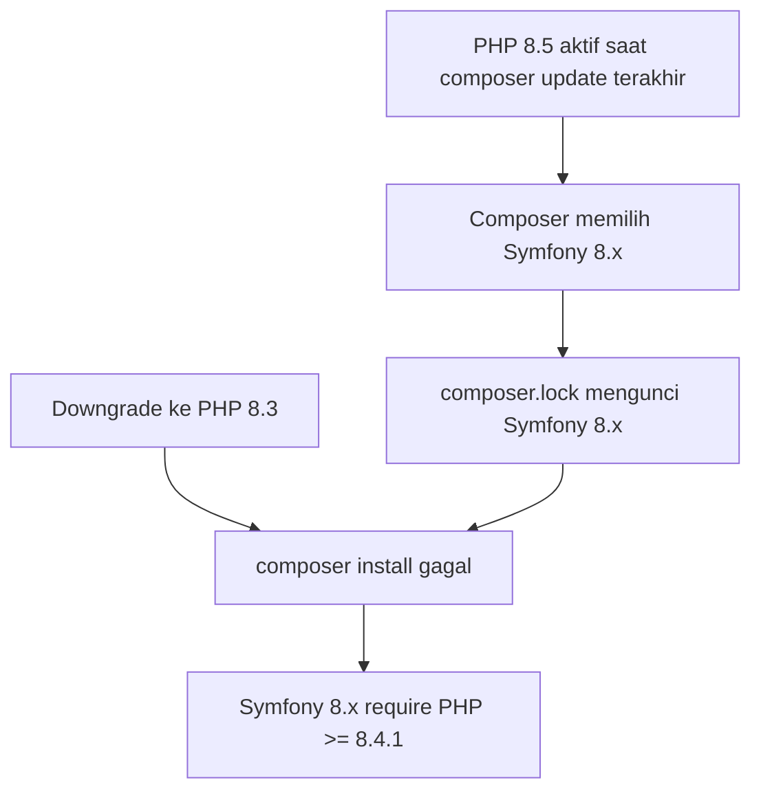

# Laporan Downgrade PHP 8.5 → 8.3

**Tanggal:** 23 Juni 2026  
**Environment:** PHP 8.3.31 (CLI)  
**Project:** Anderson Farm Backend (Laravel 13)

---

## Ringkasan

Setelah downgrade PHP dari **8.5** ke **8.3**, perintah `composer install` **gagal** (exit code 2) karena `composer.lock` masih mengunci dependensi yang dibuat saat PHP 8.5 aktif. Penyebab utamanya adalah paket **Symfony 8.x** yang mensyaratkan PHP **≥ 8.4.1**.

`composer.json` sudah benar (`"php": "^8.3"`), tetapi lock file belum disesuaikan dengan platform baru.

---

## Hasil `composer install` (sebelum perbaikan lock file)

```text
Your lock file does not contain a compatible set of packages. Please run composer update.
```

Total **18 masalah** terdeteksi oleh Composer.

---

## Paket yang Menyebabkan Error

### 1. Symfony 8.x (penyebab langsung)

Semua paket berikut terkunci di versi yang **tidak kompatibel** dengan PHP 8.3:

| Paket | Versi di lock (lama) | Requirement PHP | Status |
|-------|----------------------|-----------------|--------|
| `symfony/clock` | v8.1.0 | `>=8.4.1` | ❌ Error |
| `symfony/console` | v8.1.0 | `>=8.4.1` | ❌ Error |
| `symfony/css-selector` | v8.1.0 | `>=8.4.1` | ❌ Error |
| `symfony/error-handler` | v8.1.0 | `>=8.4.1` | ❌ Error |
| `symfony/event-dispatcher` | v8.1.0 | `>=8.4.1` | ❌ Error |
| `symfony/finder` | v8.1.0 | `>=8.4.1` | ❌ Error |
| `symfony/http-foundation` | v8.1.0 | `>=8.4.1` | ❌ Error |
| `symfony/http-kernel` | v8.1.0 | `>=8.4.1` | ❌ Error |
| `symfony/mailer` | v8.1.0 | `>=8.4.1` | ❌ Error |
| `symfony/mime` | v8.1.0 | `>=8.4.1` | ❌ Error |
| `symfony/process` | v8.1.0 | `>=8.4.1` | ❌ Error |
| `symfony/routing` | v8.1.0 | `>=8.4.1` | ❌ Error |
| `symfony/string` | v8.1.0 | `>=8.4.1` | ❌ Error |
| `symfony/translation` | v8.1.0 | `>=8.4.1` | ❌ Error |
| `symfony/uid` | v8.1.0 | `>=8.4.1` | ❌ Error |
| `symfony/var-dumper` | v8.1.0 | `>=8.4.1` | ❌ Error |
| `symfony/yaml` | v8.0.8 | `>=8.4` | ❌ Error |

> **Catatan:** Symfony 8 dirilis dengan requirement minimum PHP 8.4. Saat `composer update` dijalankan di PHP 8.5, Composer memilih Symfony 8.x karena memenuhi constraint `^7.4.0 || ^8.0.0` dari Laravel 13.

### 2. Dependensi tidak langsung (terdampak via Symfony)

| Paket | Versi | Masalah | Keterangan |
|-------|-------|---------|------------|
| `nunomaduro/collision` | v8.9.3 | ❌ Error (indirect) | Membutuhkan `symfony/console ^7.4.8 \|\| ^8.0.4`; Composer memilih v8.1.0 yang butuh PHP ≥ 8.4.1 |

### 3. Paket yang **kompatibel** dengan PHP 8.3 (tidak bermasalah)

Paket berikut **tidak** menjadi penyebab error saat downgrade:

| Paket | Requirement PHP | Status |
|-------|-----------------|--------|
| `laravel/framework` | `^8.3` | ✅ OK |
| `pestphp/pest` | `^8.3.0` | ✅ OK |
| `nunomaduro/collision` (langsung) | `^8.2.0` | ✅ OK |
| `dragonmantank/cron-expression` | `^8.2\|^8.3\|^8.4\|^8.5` | ✅ OK |
| `nette/schema` | `8.1 - 8.5` | ✅ OK |
| `nette/utils` | `8.2 - 8.5` | ✅ OK |
| `brianium/paratest` | `~8.3.0 \|\| ~8.4.0 \|\| ~8.5.0` | ✅ OK |

---

## Analisis Akar Masalah



1. **Lock file stale** — `composer.lock` dibuat di lingkungan PHP 8.5, sehingga Symfony 8.x terpilih.
2. **Laravel 13 mendukung dua jalur Symfony** — constraint `^7.4.0 || ^8.0.0` memungkinkan Symfony 7.4 (PHP 8.2+) atau Symfony 8 (PHP 8.4+).
3. **`composer install` tidak mengubah versi** — hanya menginstal apa yang ada di lock file; tidak menyelesaikan konflik platform.

---

## Solusi

### Solusi utama (direkomendasikan): Regenerasi lock file di PHP 8.3

Jalankan di mesin dengan PHP 8.3:

```bash
composer update
```

Ini akan:

- Menurunkan Symfony dari **8.x → 7.4.x** (kompatibel PHP 8.3)
- Memperbarui dependensi terkait secara otomatis
- Menulis ulang `composer.lock` untuk platform PHP 8.3

**Hasil verifikasi setelah `composer update`:**

| Aksi | Hasil |
|------|-------|
| `composer install` | ✅ Berhasil |
| `composer check-platform-reqs` | ✅ Semua requirement terpenuhi |
| `php artisan --version` | ✅ Laravel Framework 13.16.1 |
| `php artisan test` | ✅ Tests passed |

**Perubahan Symfony utama (downgrade):**

| Paket | Sebelum | Sesudah |
|-------|---------|---------|
| `symfony/console` | v8.1.0 | v7.4.13 |
| `symfony/http-kernel` | v8.1.0 | v7.4.13 |
| `symfony/yaml` | v8.0.8 | v7.4.13 |
| *(dan 13 paket Symfony lainnya)* | v8.1.0 | v7.4.x |

### Solusi alternatif: Pin Symfony ke 7.4 (opsional, lebih eksplisit)

Tambahkan di `composer.json` untuk mencegah Symfony 8 terpilih di masa depan:

```json
{
    "require": {
        "symfony/console": "^7.4",
        "symfony/http-kernel": "^7.4"
    },
    "config": {
        "platform": {
            "php": "8.3.31"
        }
    }
}
```

Kemudian jalankan `composer update`.

> **Catatan:** Laravel 13 sudah menyertakan `symfony/polyfill-php84`, `symfony/polyfill-php85`, dan `symfony/polyfill-php86` sehingga fitur PHP 8.4+ tetap tersedia via polyfill meskipun memakai Symfony 7.4.

### Solusi yang **tidak** direkomendasikan

| Opsi | Alasan |
|------|--------|
| `--ignore-platform-reqs` | Menyembunyikan masalah; runtime bisa error |
| Naikkan kembali ke PHP 8.4+ | Bertentangan dengan keputusan downgrade |
| Downgrade Laravel ke v12 | Scope besar, tidak diperlukan |

---

## Langkah Pasca-Perbaikan

1. **Commit `composer.lock` baru** setelah `composer update` di PHP 8.3 agar tim/CI konsisten.
2. **Sesuaikan CI/CD** — pastikan pipeline memakai PHP 8.3 (bukan 8.5).
3. **Update dokumentasi internal** yang masih menyebut PHP 8.5:
   - `GEMINI.md` — masih menyebut `php - 8.5`
   - `.agents/rules/global-development.md` — masih menyebut PHP 8.4
   - `AGENTS.md` — sudah diperbarui ke PHP 8.3 ✅
4. **Server production/staging** — pastikan versi PHP di server juga 8.3.x.

---

## Perintah Verifikasi

```bash
# Cek versi PHP
php -v

# Install dependensi
composer install

# Cek requirement platform
composer check-platform-reqs

# Cek aplikasi berjalan
php artisan --version

# Jalankan test
php artisan test --compact
```

---

## Kesimpulan

| Aspek | Detail |
|-------|--------|
| **Penyebab error** | 17 paket Symfony 8.x di `composer.lock` membutuhkan PHP ≥ 8.4 |
| **Dampak** | `composer install` gagal total; dependensi tidak terinstal |
| **Solusi** | `composer update` di PHP 8.3 → Symfony diturunkan ke 7.4.x |
| **Risiko runtime** | Rendah; Laravel 13 dirancang mendukung Symfony 7.4 dan 8.0 |
| **Aksi tim** | Commit lock file baru + samakan PHP version di semua environment |
